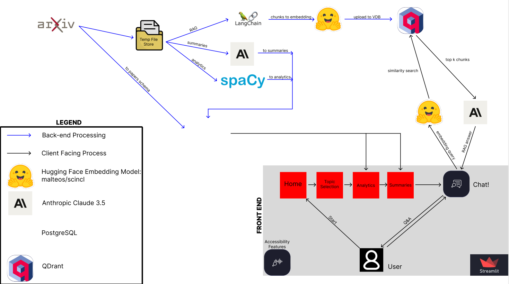
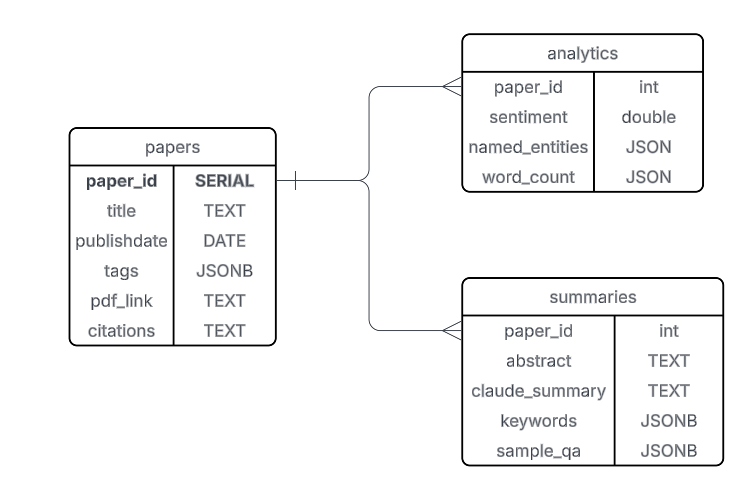
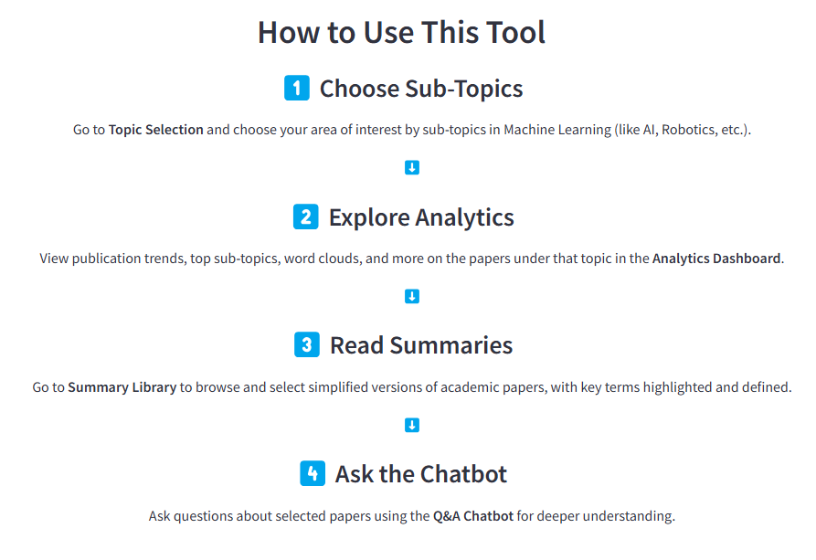

# Project ReadMe
## Building the AI-Powered Dashboard for Understanding the Latest Machine Learning Research
###### Capstone Project submitted in partial fulfillment of the requirements for the Master of Applied Data Science degree in the School of Information of the University of Michigan, April 2025

**TLDR to command to run app**: 
1. Install envrionment: `pip install -r requirements.txt`
2. Streamlit: `streamlit run codebase/1_Home.py --server.fileWatcherType=none`

*Optional*: running `pipeline.py` due to time

### Project Overview
The goal of Project ReadMe is to create a learning tool to help non-specialists understand specialized content. The ReadMe tool enables users to efficiently identify relevant scholarly articles on topics of interest and uses techniques such as LLM summarization and Retrieval-Augmented Generation (RAG), analytics, and glossing to unpack dense article content and guide users through it. To further boost accessibility, ReadMe includes features to customize the formatting of content. Once users have completed exploration of article content through our tool, they are encouraged to dive into the original article.

This repository is a companion to the project report (included herein for convenience) and contains all of the code necessary to reproduce the ReadMe tool as well as report graphs. 

*Disclaimer* :
The purpose of ReadMe is to assist users in understanding original article content, and it uses generative AI technology to accomplish this goal. The content generated by this tool is intended as an entry point into subject matter, not as an end point to discovery and knowledge acquisition. The content presented via this tool is not to be considered an authoritative source in and of itself. Because of how generative AI is trained and the way it works, this technology and tools reliant upon it may produce hallucinated (“made up”), even offensive, content. Although the creators of ReadMe have taken precautions to prevent occurrences of such content, the potential remains. As such, the creators disavow and apologize for any occurrences of offensive content. Furthermore, users are strongly encouraged to verify information presented by this tool by consulting the original article. If further guidance is needed, users are encouraged to consult additional articles or subject-matter experts. The authors of the original articles are responsible for the content therein. 

### Requirements and Installation
Dependencies for this project were managed via a virtual environment built in Conda and stored in the “environment.yml” file. To run the code for this project, simply import these requirements into a local environment.

To install Conda, follow the instructions available from the service: https://docs.conda.io/projects/conda/en/latest/user-guide/install/index.html

For detailed instructions on setting up an environment with Conda, please reference: https://docs.conda.io/projects/conda/en/stable/user-guide/tasks/manage-environments.html

Dependencies in this project were managed using `venv` and stored in the 
`requirements.txt` file on WSL. To run the code run `pip -r requirements.txt` and 
to use the app afterwards, run `streamlit run codebase/1_Home.py --server.fileWatcherType=none`

### Access the Data
The data used for this project is sourced from the arXiv API, and the authors wish to thank arXiv for use of its open access interoperability. Although it is open source, there are some limitations for download and use. For more detailed information about accessing and using the API, please reference the following pages:

1. arXiv API Access Help: https://info.arxiv.org/help/api/
2. Terms of Use: https://info.arxiv.org/help/api/tou.html
3. User Manual: https://info.arxiv.org/help/api/user-manual.html 

Code to automate pulling in the data is available in `pipeline.py`. Changes to
the file require the start and end date to be chagned in the file. It is a 
computationally intensive file, so uploads alone take some time. Chunking and 
Claude summaries are the longest part, with each day taking about 10-15 minutes
in total. This cannot be optimized besides running on a GPU, which is recommended.

### Navigating the Repository
- `codebase`: module used for all operations of the project
  - `pages`: sub-module for streamlit pages for front end
  - `python files`: organization of functions groupped with related file names
- `Evaluation.py` and `Summary.py`: reproducible methods for creating metrics for
RAG and summaries
- `pipeline.py`: data pipeline for collecting, processing, and storing data; 
also a file for reproducible graphics is available for use

### PostgesSQL Database Architecture
This tool utilizes a PostgresSQL database to support the analytics and RAG functionality behind its User Interface. The architecture of this database is visualized below.

### User Interface Navigation
Below is a preview of the User Interface structure and navigation.

## AI Assistance and External References

This project was developed as part of the README – A Research Paper Analysis Tool, submitted April 2025 by Luis Gallego, Katherine Godwin, Samarth Somani, and Samantha Russel.

### AI Contributions (ChatGPT – OpenAI, April 2025)

Portions of this code were developed or debugged with help from ChatGPT for the following purposes:

- Chatbot conversational logic, including integration of LangChain’s `ConversationalRetrievalChain` for retrieval-augmented generation (RAG)
- Setup of Streamlit’s `st.session_state` to manage persistent conversation flow between user and assistant
- Function design and styling for highlighting technical terms with tooltips using HTML and CSS
- Suggestions for custom tooltip styling and structure for accessibility
- Debugging assistance in text parsing and keyword extraction logic using regex
- Designing the custom README logo
- Light UI design guidance, including markup for sidebar logos and summary expansion cards

All AI-assisted code was reviewed, modified, and integrated by the development team to ensure accuracy and relevance to the project.

AI source: [ChatGPT](https://chat.openai.com/) (OpenAI, model version April 2025)

### External Resources Consulted

In addition to AI support, the following resources were consulted during development:

- [LangChain documentation](https://docs.langchain.com/) for vector store integration, chat model usage, and memory handling
- [Streamlit documentation](https://docs.streamlit.io/) for layout, state handling, and multipage app setup
- [Matplotlib documentation](https://matplotlib.org/stable/) for visualizations and chart customization
- [pandas documentation](https://pandas.pydata.org/docs/) for data manipulation and formatting
- [Stack Overflow](https://stackoverflow.com/) for general troubleshooting, syntax clarification, and community best practices
- [Streamlit dashboard development blog post](https://blog.streamlit.io/crafting-a-dashboard-app-in-python-using-streamlit/#2-perform-eda-analysis) for design inspiration and layout ideas

### Notes on Integrity and Authorship

All code in this repository is original unless otherwise attributed. Any components influenced by AI assistance are clearly marked within the codebase via inline comments or documentation headers. The project team used AI tools in a limited, supportive capacity and retains full authorship and responsibility for the implementation, architecture, and design decisions made throughout development.

This project is compliant with academic integrity standards and reflects responsible and transparent use of AI in software development.
